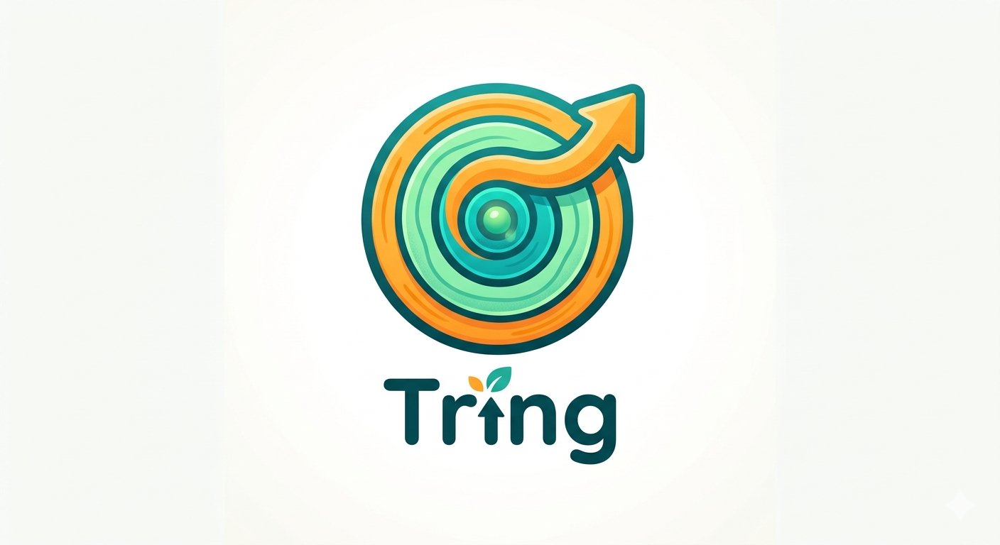

# tring

A CLI tool to track and update local dependencies across multiple sources.

<div align="center">

</div>

## Overview

tring extracts dependencies from various sources (go.mod, envfile, GitHub Actions workflows), resolves new versions using configurable resolvers, and applies updates based on policy constraints.

**Scope**: This tool is responsible for updating dependencies locally. GitHub push, PR creation, CI execution, and release creation are out of scope.

## Why tring?

### Security-First Approach

Unlike automated dependency update services (Renovate, Dependabot), tring **only modifies local files** and never pushes changes automatically.

In GitHub, users with write access can read repository secrets. Automated services that push dependency updates could potentially introduce malicious versions (e.g., compromised GitHub Actions, npm packages) that exfiltrate secrets during CI runs.

**tring's Approach**:
- Updates are applied locally, giving you full control
- Review changes before committing with `--dry-run`
- No tokens or credentials stored in external services
- Run in your local environment or controlled CI without write permissions

### Other Benefits

- **Flexible grouping**: Update Kubernetes modules together with `align` constraints
- **Policy control**: `min_release_age` ensures you don't adopt versions that are too new
- **Multi-source**: Single tool for go.mod, envfile, and GitHub Actions workflows
- **Aqua support**: Update `aqua.yaml` package versions and standard registry refs
- **Transparent**: Simple YAML config, no magic

## Installation

```bash
go install github.com/ystkfujii/tring/cmd/tring@latest
```

Or build from source:

```bash
git clone https://github.com/ystkfujii/tring.git
cd tring
go build -o tring ./cmd/tring
```

## Quick Start

1. Create a configuration file `tring.yaml`:

```yaml
version: 1

groups:
  - name: go-deps
    resolver: goproxy
    sources:
      - type: gomod
        config:
          manifest_paths:
            - go.mod
    policy:
      selection:
        strategy: patch
        min_release_age: 7d
```

2. Run in dry-run mode to see planned changes:

```bash
tring apply --config tring.yaml --group go-deps --dry-run
```

3. Apply the changes:

```bash
tring apply --config tring.yaml --group go-deps
```

## CLI Usage

```bash
tring apply [flags]

Flags:
  -c, --config string   Path to configuration file (default "tring.yaml")
  -g, --group string    Group name to apply (required)
      --dry-run         Show planned changes without applying
      --diff-link       Show diff links where available (best-effort)
```

### Exit Codes

- `0`: Success
- `1`: Validation error (invalid config, group not found, etc.)
- `2`: Runtime error (resolver error, source error, etc.)

## Versioning

### SemVer Requirement

tring currently operates on **Semantic Versioning (SemVer)** assumptions:

- All version comparisons are based on SemVer (major.minor.patch)
- The `patch` strategy selects the highest patch version within the same major.minor
- The `minor` strategy selects the highest minor.patch version within the same major
- Versions that cannot be parsed as SemVer are skipped by resolvers

### Prerelease Handling

- If the current version is **stable** (no prerelease suffix), only stable candidates are considered
- If the current version is a **prerelease** (e.g., `v1.0.0-rc.1`), both stable and prerelease candidates are allowed

**Go version normalization:**

Go uses non-standard prerelease format (e.g., `go1.23rc1`, `go1.23beta2`). tring normalizes these to SemVer format internally:
- `go1.23rc1` → `1.23.0-rc.1`
- `go1.23beta2` → `1.23.0-beta.2`

When writing back to `go.mod`, versions are formatted appropriately:
- `go` directive: `go 1.23` (major.minor only)
- `toolchain` directive: `toolchain go1.23.0` (full version with `go` prefix)

### Diff Links

When `--diff-link` is enabled, tring generates GitHub compare links on a best-effort basis:
- For `github.com/*` Go modules: links are generated automatically
- For GitHub Actions (`owner/repo`): links are generated automatically
- For other module paths: no diff link is generated

## Configuration

### Structure

```yaml
version: 1

defaults:
  policy:
    selection:
      strategy: patch
      min_release_age: 3d

groups:
  - name: <group-name>
    description: <optional description>
    resolver: <resolver-type>
    sources:
      - type: <source-type>
        config: <source-specific-config>
    selectors:
      include:
        module_patterns:
          - <pattern>
      exclude:
        module_patterns:
          - <pattern>
    policy:
      selection:
        strategy: <strategy>
        min_release_age: <duration>
      constraints:
        - type: align
          anchor: <module-name>
          members:
            - <module-name>
          required: true
```

### Sources

#### gomod

Extracts dependencies from `go.mod` files.

```yaml
- type: gomod
  config:
    manifest_paths:
      - go.mod
      - tools/go.mod
```

**Options:**

| Option | Type | Default | Description |
|--------|------|---------|-------------|
| `manifest_paths` | list | (required) | Paths to go.mod files |
| `include_require` | bool | `true` | Extract module dependencies from `require` statements |
| `track_go_version` | bool | `false` | Track the `go` directive version |
| `track_toolchain` | bool | `false` | Track the `toolchain` directive version |

**Example: Track Go runtime version**

```yaml
- type: gomod
  config:
    manifest_paths:
      - go.mod
    include_require: false      # Don't track module dependencies
    track_go_version: true      # Track 'go 1.22' directive
    track_toolchain: true       # Track 'toolchain go1.22.0' directive
```

#### envfile

Extracts version variables from envfiles.

```yaml
- type: envfile
  config:
    file_paths:
      - versions.env
    variables:
      - name: K8S_API_VERSION
        resolve_with: k8s.io/api
```

Supported variable formats:
- `FOO = v1.2.3`
- `FOO := v1.2.3`
- `FOO ?= v1.2.3`

#### githubaction

Extracts GitHub Actions dependencies from workflow files. Supports both version refs and SHA-pinned refs with version comments.

```yaml
- type: githubaction
  config:
    file_paths:
      - .github/workflows/ci.yaml
      - .github/workflows/release.yaml
```

Supported formats:
- `uses: owner/repo@v1.2.3` (version ref)
- `uses: owner/repo@abc123...def456 # v1.2.3` (SHA-pinned with version comment)
- `uses: owner/repo/subpath@v1.2.3` (subpath action)

When updating SHA-pinned refs, both the SHA and version comment are updated.

#### aqua

Extracts package versions and standard registry refs from `aqua.yaml`.

```yaml
- type: aqua
  config:
    file_paths:
      - aqua.yaml
    targets:
      - packages
      - registries
    unsupported_version: skip
```

Supported package formats:
- `name: owner/repo@v1.2.3`
- `name: owner/repo` with `version: v1.2.3`
- prefixed raw versions such as `kustomize/v5.8.0`
- `registry: local` with a local registry declared in the same `aqua.yaml`

Supported registry targets:
- `registries[].type: standard` with `ref: vX.Y.Z`

Notes:
- Versions are compared as SemVer, while aqua-specific raw versions are preserved for write-back
- Non-SemVer aqua versions can be skipped or treated as errors via `unsupported_version`

### Resolvers

#### goproxy

Resolves Go module versions using the Go module proxy.

```yaml
resolver: goproxy
```

Uses `proxy.golang.org` by default. Custom proxy URL can be specified:

```yaml
resolver: goproxy
resolver_config:
  proxy_url: https://goproxy.io
  timeout: 60s
```

Note: Only versions that can be parsed as SemVer are returned as candidates.

#### githubrelease

Resolves GitHub repository versions using the GitHub API. Fetches tags and their associated commit SHAs.

```yaml
resolver: githubrelease
```

Uses `api.github.com` by default. For authentication, set the `GITHUB_TOKEN` environment variable.

Note: Only tags that can be parsed as SemVer (e.g., `v1.2.3`) are returned as candidates. Floating tags like `main`, `master`, or `v2` are skipped.

#### gotoolchain

Resolves Go toolchain versions using the official Go downloads API. Use with `gomod` source's `track_go_version` and `track_toolchain` options.

```yaml
resolver: gotoolchain
```

Uses `go.dev/dl/?mode=json` by default. Custom base URL can be specified:

```yaml
resolver: gotoolchain
resolver_config:
  base_url: https://go.dev/dl/
  timeout: 30s
```

**Limitations:**
- Only stable Go releases are considered (prereleases like `go1.23rc1` are excluded)
- `min_release_age` is not supported because the Go downloads API doesn't provide release timestamps

**Example: Track Go runtime version**

```yaml
groups:
  - name: go-runtime
    resolver: gotoolchain
    sources:
      - type: gomod
        config:
          manifest_paths:
            - go.mod
          include_require: false
          track_go_version: true
          track_toolchain: true
    policy:
      selection:
        strategy: minor
```
#### aqua_registry

Resolves aqua package candidates from `aqua-registry`.

```yaml
resolver: aqua_registry
resolver_config:
  api_url: https://api.github.com
  registry_base_url: https://raw.githubusercontent.com/aquaproj/aqua-registry
  github_token_env: GITHUB_TOKEN
```

Supported in v1:
- standard registry refs backed by `aquaproj/aqua-registry`
- local registries referenced from `aqua.yaml`
- `version_source: github_release`
- `version_source: github_tag`
- `version_prefix`
- simple `version_filter` forms using `Version matches "..."` or `not (Version matches "...")`

### Selectors

Filter dependencies by name patterns.

**Supported patterns:**
- `*` - matches all modules
- `prefix/*` - matches modules starting with `prefix/`
- `exact/match` - exact match (no wildcards)

**Not supported:**
- `**` (recursive glob)
- Multiple wildcards (e.g., `*foo*`)
- Wildcards in the middle (e.g., `foo*bar`)

```yaml
selectors:
  include:
    module_patterns:
      - '*'                    # Match all
      - 'github.com/foo/*'     # Match specific org
  exclude:
    module_patterns:
      - 'k8s.io/*'            # Exclude Kubernetes modules
```

### Policy

#### Selection Strategy

- `patch`: Update to the latest patch version within the same major.minor
- `minor`: Update to the latest minor.patch version within the same major
- `major`: Allow updates across major versions (no major-based filtering)

#### min_release_age

Exclude candidates newer than the specified duration.

```yaml
min_release_age: 7d   # 7 days
min_release_age: 24h  # 24 hours
```

### Constraints

#### align

Ensure multiple modules share the same version (useful for Kubernetes modules).

```yaml
constraints:
  - type: align
    name: kubernetes-core
    anchor: k8s.io/apimachinery
    members:
      - k8s.io/api
      - k8s.io/apimachinery
      - k8s.io/client-go
    required: true
```

- `anchor`: The module whose version is used as the reference
- `members`: Modules to align with the anchor's version
- `required`: If `true`, fail if alignment cannot be achieved

## Output Example

```
[DRY RUN] No files will be modified.

Group: go-deps
==============

Planned Changes:
  File: go.mod
    github.com/spf13/cobra
      v1.8.0 -> v1.8.1 (patch)

Skipped:
  github.com/stretchr/testify: already at latest version

Total: 1 change(s), 1 skipped
```

## Dependencies

| Library | Purpose |
|---------|---------|
| [github.com/spf13/cobra](https://github.com/spf13/cobra) | CLI framework - the standard choice for Go CLIs |
| [golang.org/x/mod/modfile](https://pkg.go.dev/golang.org/x/mod/modfile) | go.mod parsing - official library, safe and reliable |
| [github.com/Masterminds/semver/v3](https://github.com/Masterminds/semver) | SemVer parsing - widely used, feature-rich |
| [gopkg.in/yaml.v3](https://github.com/go-yaml/yaml) | YAML parsing - simple and sufficient |

## Architecture

```
internal/
├── app/apply/        # Use case layer
├── cli/              # CLI commands (cobra)
├── config/           # Config loading and validation
├── domain/
│   ├── model/        # Core domain models (Dependency, Candidate, etc.)
│   ├── planner/      # Planning logic
│   └── constraint/   # Constraint implementations
└── output/render/    # Output rendering

pkg/impl/
├── bootstrap/        # Registration of all implementations
├── aqua/             # Shared aqua helpers
├── resolver/         # Resolver implementations
│   ├── aqua_registry/# aqua-registry resolver
│   ├── goproxy/      # Go module proxy resolver
│   ├── githubrelease/# GitHub release/tag resolver
│   └── gotoolchain/  # Go toolchain resolver (go.dev)
└── sources/          # Source implementations
    ├── aqua/         # aqua.yaml source
    ├── gomod/        # go.mod source
    ├── envfile/      # envfile source
    └── githubaction/ # GitHub Actions workflow source
```

### Design Principles

1. **Domain is pure**: No dependencies on cobra, yaml, http, or file format details
2. **SemVer-only**: All version handling assumes Semantic Versioning
3. **Config parsing is isolated**: Source-specific config is unmarshaled in impl layer
4. **Registry pattern**: Sources and resolvers are registered explicitly via bootstrap
5. **Testable**: HTTP clients are injectable, pure logic is separated from I/O

## Development

### Build

```bash
go build ./...
```

### Test

```bash
go test ./...
```

### Lint

```bash
go vet ./...
```

## Acknowledgements

This project was built with Claude Code, Copilot, and a few friendly sidekicks.
